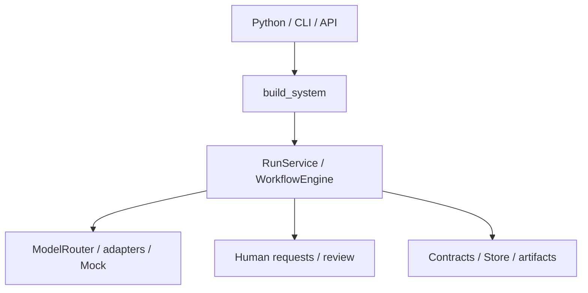

# Architecture

## Purpose

Multi-Agent Framework is evolving into a configurable runtime for teams of intelligent capabilities. The current baseline coordinates sequential social-content workflows with local/cloud models and human participation. Provider adapters are separated, but requests, context, some routing, and validation still contain domain assumptions.

See the [verified architecture review](ARCHITECTURE_REVIEW.md), [proposed decisions](ARCHITECTURE_DECISIONS.md), and [ordered roadmap](../ROADMAP.md) for the distinction between implemented behavior and target architecture.

## Main components

This is the same Core for every client. Direct Python use does not require a running FastAPI server; see the [Python quickstart](PYTHON_QUICKSTART.md).

### `multiagent/api.py`

Exposes the HTTP API for creating and querying runs, approving or rejecting artifacts, requesting revisions, cancelling runs, and completing externally executed human-guided steps.

### `multiagent/cli.py`

Provides development and operational commands for diagnostics, runs, Human-in-the-Loop flows, assets, publications, metrics, and branding.

### `multiagent/workflow_engine.py`

Executes workflow steps, builds context, applies routing, validates contracts, persists artifacts, and pauses execution at human checkpoints.

### `multiagent/model_router.py`

Selects the preferred model and optional fallback according to workflow bindings and execution mode.

### `multiagent/adapters/`

Isolates provider-specific behavior behind `LLMAdapter.generate_structured`. Workflows declare model bindings and output contracts. Agent capabilities are currently descriptive YAML metadata and do not drive dispatch. `FakeAdapter` uses the same engine and contracts with fixed example outputs.

### `workflows/`

Contains declarative definitions for agent order, prompts, contracts, preferred models, fallbacks, conditions, and checkpoints.

### `prompts/` and `skills/`

Contain versioned prompts and reusable instruction fragments assembled by the runtime.

### `multiagent/contracts.py`

Defines the Pydantic input and output contracts exchanged between workflow steps.

### `multiagent/db/`

Provides SQLite persistence, migrations, and access to run state, artifacts, projects, brand profiles, assets, publications, and telemetry.

## Local persistence

Runtime data is not versioned source. By default it is stored under `.local/data/`; `LOCAL_DIR` can place it outside the checkout. A private implementation can explicitly load an external `.env` through Python Settings. Public definition directories are still checkout-relative; a preset overlay loader is not implemented. See the [private implementation strategy](PRIVATE_PRESETS.md).

Run state and human waits survive process restarts, but definitions are reloaded from YAML and step persistence is not one atomic operation. The current queue worker supports one local consumer. `LocalWorker` is not an AgentDefinition-derived WorkerInstance.

## Frontend

The current `F00` release does not include a UI. A future frontend should consume the public API and structured runtime events rather than access SQLite or parse text logs. Runtime observability must be UI-agnostic: live and historical projections share persisted facts, while colors, layouts, and animations belong to clients. The existing event records need stronger identity/correlation semantics before they can power a reliable Communication Graph or Live Topology.
