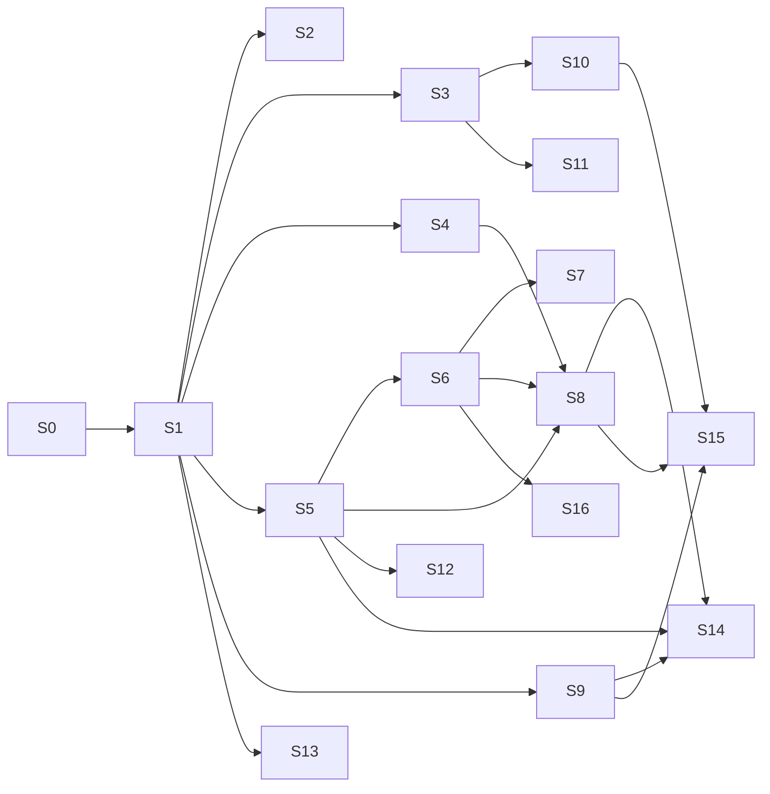

# Roadmap stage plan

This plan breaks the [roadmap](../ROADMAP.md) into stages, sub-stages, and tasks with their dependencies, so it is clear where the project is going, what each stage includes, and which work can run in parallel. It is informative: it assigns no people or agents, sets no dates, and changes as the project learns. The roadmap's checkboxes remain the record of what is done.

## How to read it

- **Stages** are numbered `S0`, `S1`, and so on. Sub-stages are `S4.A`, `S4.B`, and so on. Tasks are `S4.A1`, `S4.A2`, and so on. The Frontend area's own levels are called *UI stage 0–4* to avoid confusion.
- **Class**, following the project's principles:
  - **Core** is domain-neutral and required.
  - **Extension** is optional: adapters, backends, clients, and catalogs. The core works without it.
  - **Example** means presets, bundles, and reference material.
- **Depends on** lists what must be finished first. Tasks with no dependency on each other can run in parallel; the *Parallel lanes* section groups them.
- **Status:** ✅ done · ◐ partial · ☐ planned. Items marked *(proposed)* close gaps found in the project inventory and still need a decision.

## Overview

| Stage | Name | Class | Depends on | Status |
| --- | --- | --- | --- | --- |
| S0 | Stable core | Core | — | ✅ |
| S1 | Application services and HTTP parity | Core | S0 | ✅ |
| S2 | Operator UI, UI stage 0 | Extension | S1 | ✅ |
| S3 | Local usage telemetry | Core | S1 | ✅ |
| S4 | Execution backend abstraction | Core + Extension | S1 | ☐ |
| S5 | Tool and capability contracts | Core | S1 | ☐ |
| S6 | Team definitions and team design | Core | S5.C | ☐ |
| S7 | Collaborative team primitives | Core | S6.A | ☐ |
| S8 | Planning and delegation | Core | S4.A, S5.C, S6.A | ☐ |
| S9 | Interoperability | Extension | S1 (S9.A), S5.A | ☐ |
| S10 | Observability and evaluation | Core + Extension | S3 | ◐ |
| S11 | Model routing and local AI | Core + Extension | S3 | ☐ |
| S12 | Memory, context, and knowledge | Core | S5.A | ☐ |
| S13 | Human-in-the-loop improvements | Core | S1 | ◐ |
| S14 | Operator UI, UI stages 1–3 | Extension | S5, S6.A, S8.B, S9 | ☐ |
| S15 | Advanced operator interface | Extension | S10.B, S9.C, S8.C | ☐ |
| S16 | Presets, examples, and catalog | Extension + Example | S6.A | ◐ |
| S17 | Security, developer experience, and releases | Core (cross-cutting) | — | ◐ |
| S18 | Long-term architecture (M2) | Core | S4–S8 stable | ☐ |

## Parallel lanes

Work in different lanes does not block each other. Inside a lane, follow the dependencies.

| Lane | Stages | Can start now |
| --- | --- | --- |
| Runtime | S4 → S8 | S4.A |
| Contracts and teams | S5 → S6 → S7 | S5.A |
| Interoperability | S9 | S9.A (MCP server only needs S1) |
| Observability and routing | S10, S11 | S10.A, S11.A |
| Human control | S13 | S13.A, S13.B |
| Examples and catalog | S16 | S16.F (reference stacks), S16.G1 (software development example) |
| Cross-cutting | S17 | all tasks |
| Later | S12, S14, S15, S18 | after their dependencies |

**Suggested next wave, in parallel:** S4.A, S5.A, S9.A, S10.A, S13.A, S16.G1, and one S17 task.

---

## Completed stages

### S0 · Stable core ✅

Validation before execution, human review after any step with resume, and definition bundles loaded from outside the package. **Example:** a user brings their own workflow bundle and runs it without changing the core.

### S1 · Application services and HTTP parity ✅

One Python facade (`multiagent.services`) used by the CLI, the HTTP API, and the UI, with generic run requests and structured errors. **Example:** the same run is created from Python, over HTTP, or with `multiagent run`.

### S2 · Operator UI, UI stage 0 ✅

A local browser console in Mock mode by default: create and follow runs, human review and the Human Bridge, artifacts, sequence-numbered events with resynchronization, a restrictive Content Security Policy, and status shown by more than color. See [UI0.md](UI0.md).

### S3 · Local usage telemetry ✅

Provider-reported token usage per run, agent, step, and attempt, with duration and failed attempts, readable from Python, HTTP, and the CLI. Local only, never sent anywhere. See [TELEMETRY.md](TELEMETRY.md).

---

## S4 · Execution backend abstraction ☐

- **Class:** Core (interface, native and mock backends) + Extension (Microsoft Agent Framework backend).
- **Objective:** run the same workflow definitions on interchangeable backends.
- **Problem it solves:** today the engine is the only way to execute. Graphs, concurrency, and mature features from other runtimes need a seam that does not change definitions, contracts, runs, or the Human Bridge.
- **Depends on:** S1.

| Task | Description | Depends on |
| --- | --- | --- |
| **S4.A — Interface** | | |
| S4.A1 | Define the backend interface: execute a step, report events and usage, pause for a human, resume, cancel. | — |
| S4.A2 | Refactor the native engine behind the interface without behavior changes. | S4.A1 |
| S4.A3 | Make Mock a backend on the same interface. | S4.A1 |
| **S4.B — Conformance** | | |
| S4.B1 | A backend conformance test suite (events, checkpoints, review, budgets, cancellation, usage). | S4.A1 |
| S4.B2 | Run the suite against the native and Mock backends in CI. | S4.A2, S4.A3, S4.B1 |
| **S4.C — Optional backend** | | |
| S4.C1 | Microsoft Agent Framework backend as an optional extra; the core never imports it. | S4.B2 |
| S4.C2 | Compile workflow definitions to its graph workflows (branching, retries, reusable fragments) instead of building a separate graph engine. | S4.C1 |
| **S4.D — Scheduling** | | |
| S4.D1 | Several workers with controlled concurrency. | S4.A2 |
| S4.D2 | A resource-aware scheduler (CPU, RAM, GPU/VRAM, provider limits) that works with any backend. | S4.D1 |

**Parallel:** S4.A2 and S4.A3; S4.C and S4.D after S4.B2.
**Acceptance:** every existing workflow runs unchanged on the native backend; the conformance suite passes for native and Mock; the optional backend installs as an extra and passes the same suite.
**Example:** `multiagent run --backend native` and, with the extra installed, `--backend maf` produce the same run record.

## S5 · Tool and capability contracts ☐

- **Class:** Core.
- **Objective:** agents use tools and deterministic functions through generic, permissioned contracts.
- **Problem it solves:** tools are tied to specific adapters; there is no common permission model or capability vocabulary for assignment and routing.
- **Depends on:** S1.

| Task | Description | Depends on |
| --- | --- | --- |
| **S5.A — Contracts** | | |
| S5.A1 | Generic tool request, result, error, and permission-request contracts, separate from model adapters. | — |
| S5.A2 | Tool registry and adapter mapping into those contracts. | S5.A1 |
| **S5.B — Permissions** | | |
| S5.B1 | Classify actions by impact: read, write, destructive, external side effect. | S5.A1 |
| S5.B2 | Route approvals through the existing human-in-the-loop. | S5.B1 |
| **S5.C — Capabilities** | | |
| S5.C1 | Namespaced capabilities (for example `file.read`, `planning.decompose`) on agents and tools. | S5.A1 |
| S5.C2 | Deterministic, configuration-based selection of tools and agents by capability. | S5.C1 |
| **S5.D — Execution** | | |
| S5.D1 | Deterministic function steps in workflows. | S5.A2, S4.A2 |
| S5.D2 | Record tool calls and outputs in the same traceability model as agents and humans. | S5.A2 |

**Parallel:** S5.B, S5.C, and S5.D2 after S5.A.
**Acceptance:** a workflow step calls an approved tool through the contract; a destructive action waits for human approval; capabilities select a tool without code changes.
**Example:** a "read file" tool is granted to one role only, and a write needs approval.

## S6 · Team definitions and team design ☐

- **Class:** Core (definitions and runtime) + Extension (generator workflow).
- **Objective:** teams, roles, members, assignments, and relationships as validated data, with an optional generator from a prompt.
- **Problem it solves:** today agents are a flat catalog. There is no organization, no role/member separation, and no way to design a team.
- **Depends on:** S5.C for capabilities; S4.A2 for S6.C.

| Task | Description | Depends on |
| --- | --- | --- |
| **S6.A — Definitions** | | |
| S6.A1 | Team definition schema: roles (purpose, rules, skills, contracts, capabilities, permissions), members, assignments, relationships. | S5.C1 |
| S6.A2 | Validation with the bundle rules and least-privilege permissions. | S6.A1 |
| S6.A3 | Human approval before a team is created or changed. | S6.A2 |
| **S6.B — Views** | | |
| S6.B1 | Render the organization chart (for example Mermaid) from relationships. | S6.A1 |
| **S6.C — Runtime roles** | | |
| S6.C1 | Role switching per step: load the role's rules and context, keep contexts separate, record role and member. | S6.A1, S4.A2 |
| **S6.D — Team design from a prompt** | | |
| S6.D1 | Meta-workflow that generates a team from an objective, or formalizes a described team and asks about gaps. | S6.A3 |
| S6.D2 | Recommended (never mandatory) model bindings per role from the capability catalog and router. | S6.D1, S11.A1 |
| S6.D3 | Regenerate as a reviewable diff and save accepted teams as presets. | S6.D1, S16.A1 |

**Parallel:** S6.B1 and S6.C1 after S6.A1; S6.D after S6.A3.
**Acceptance:** a team file validates, is approved by a human, and runs with role switching recorded in the trace.
**Example:** "a research team of three with a reviewer" becomes a team definition and an org chart for approval.

## S7 · Collaborative team primitives ☐

- **Class:** Core (primitives) + Example (software development preset).
- **Objective:** two or more agents and humans work on shared resources safely.
- **Problem it solves:** coordination (inboxes, proposals, gates, synchronization) exists only as project-specific practice, not as framework capabilities.
- **Depends on:** S6.A.

| Task | Description | Depends on |
| --- | --- | --- |
| **S7.A — Communication** | | |
| S7.A1 | Append-only team log and per-member inboxes where reading acknowledges. | S6.A1 |
| S7.A2 | Structured messages and handoffs (delivery, proposal, question, answer, decision, result). | S7.A1 |
| **S7.B — Work control** | | |
| S7.B1 | Scoped workspaces: members change only assigned resources; shared ones need approval. | S6.A1 |
| S7.B2 | *(proposed)* Task reservation with declared resources: taking a task reserves its resources and rejects overlaps. | S7.B1 |
| S7.B3 | Change proposals in an ordered queue with held drafts; a supervisor applies them. | S7.B1 |
| S7.B4 | *(proposed)* Dependency-aware integration gate: a change waits until its task is finished and its dependencies are applied and verified. | S7.B3 |
| **S7.C — Quality gates** | | |
| S7.C1 | Cross-review and stage gates that close only with passing shared checks and supervisor approval. | S7.B3 |
| S7.C2 | Check results with visibility rules and one designated reader per report. | S7.C1 |
| S7.C3 | Workspace synchronization after each approved stage, with confirmation and no lost work. | S7.C1 |
| **S7.D — Modes and budgets** | | |
| S7.D1 | Supervised and autonomous operating modes. | S7.C1 |
| S7.D2 | Per-member token and cost budgets and minimal-reading rules. | S3, S7.A1 |
| S7.D3 | Resumable status snapshot and readable views of progress and pending decisions. | S7.A2 |

**Parallel:** S7.A and S7.B from the start; S7.D2 in parallel with S7.C.
**Acceptance:** two agents deliver changes to different scoped resources; a supervisor applies them in order; a stage closes only with passing checks.
**Example:** a software development preset where resources are files, changes are patches, and checks are test suites.

## S8 · Planning and delegation ☐

- **Class:** Core (plans, planners interface, assignment) + Extension (LLM or external planners).
- **Objective:** turn an objective into an executable, traceable plan for a user-defined team.
- **Problem it solves:** today every step and order is declared by hand; there is no decomposition, assignment, or replanning.
- **Depends on:** S4.A, S5.C, S6.A.

| Task | Description | Depends on |
| --- | --- | --- |
| **S8.A — Plans as data** | | |
| S8.A1 | Plan schema: tasks, subtasks, dependencies, capabilities, contracts, assignments, parallel groups, review and integration steps. | S6.A1 |
| S8.A2 | Execute plans through the existing engine and backends, not a second engine. | S8.A1, S4.A2 |
| **S8.B — Manual planning** | | |
| S8.B1 | Manual planner and plan editing before and during execution. | S8.A2 |
| S8.B2 | Delegation traceability: who created and assigned each task and why, attempts, reviews, results. | S8.A2 |
| **S8.C — Assignment** | | |
| S8.C1 | Assignment by capabilities, roles, tools, permissions, availability, and budget, with deterministic rules first. | S8.A1, S5.C2 |
| S8.C2 | Plan constraints: budgets, local-only execution, allowed providers, required approvals. | S8.C1 |
| **S8.D — Assisted planning** | | |
| S8.D1 | Pluggable planners (manual, deterministic, LLM-based, custom, external). | S8.B1 |
| S8.D2 | Semi-automatic plans that wait for human approval, where users can edit, reassign, or reject them. | S8.D1, S13.B1 |
| S8.D3 | Automatic planning within declared limits. | S8.D2 |
| **S8.E — Adaptation** | | |
| S8.E1 | Replanning on failure, rejection, unavailability, or new information. | S8.D2 |
| S8.E2 | Temporary teams proposed from the agent catalog for approval. | S8.E1, S6.D1 |

**Parallel:** S8.B and S8.C after S8.A.
**Acceptance:** a manual plan with parallel groups runs end to end with a full trace; a semi-automatic plan pauses for approval; constraints are enforced.
**Example:** "prepare a market report" becomes a plan with research in parallel, a synthesis, and a review.

## S9 · Interoperability ☐

- **Class:** Extension (the core defines contracts; protocols live in adapters).
- **Objective:** use the framework from other tools and let it use external tools and applications.
- **Problem it solves:** today the framework is reachable only through its CLI, API, and UI, and only calls model providers.
- **Depends on:** S1 for S9.A; S5.A for the rest.

| Task | Description | Depends on |
| --- | --- | --- |
| **S9.A — MCP server** | | |
| S9.A1 | Expose the application services as an MCP server: workflows, runs, pending human steps, artifacts. | — |
| **S9.B — Channels** | | |
| S9.B1 | Shared-folder channel: file requests and responses with correlation, atomic writes, timeouts, deduplication, permissions, and an audit trail. | S5.A1 |
| S9.B2 | Assisted desktop bridge: prepare the prompt, use the clipboard, open an application, import the response. | S9.B1 |
| **S9.C — Clients** | | |
| S9.C1 | MCP client behind the tool abstraction, through the official SDK or the optional backend. | S5.A2 |
| S9.C2 | A2A adapter when a concrete need appears. | S5.A2 |
| **S9.D — Applications** | | |
| S9.D1 | Application gateway and launcher, with launching and controlling kept separate. | S5.B2 |
| S9.D2 | External application adapters (design, CAD/BIM, 3D, media, office, development) as plugins. | S9.D1 |

**Parallel:** S9.A right away; S9.B and S9.C after S5.A.
**Acceptance:** an MCP client can list workflows and start a run; a shared-folder request round-trips with a receipt.
**Example:** an editor with MCP support starts a review run and answers its human step.

## S10 · Observability and evaluation ◐

- **Class:** Core (records and reports) + Extension (exporters).
- **Objective:** understand, compare, and audit runs.
- **Depends on:** S3 ✅.

| Task | Description | Depends on |
| --- | --- | --- |
| **S10.A — Telemetry** | | |
| S10.A1 | Retry counts, routing-decision telemetry, and token estimates. | — |
| S10.A2 | Exportable run reports for debugging and audit. | — |
| **S10.B — Standards** | | |
| S10.B1 | OpenTelemetry traces and metrics (GenAI conventions) alongside domain events. | S10.A1, S4.A1 |
| **S10.C — Evaluation** | | |
| S10.C1 | Structured evaluation datasets for agents, prompts, and workflows. | — |
| S10.C2 | Regression tracking when prompts, models, workflows, or providers change. | S10.C1 |
| S10.C3 | Local versus cloud comparison on the same contracts. | S10.C1, S11.B1 |
| **S10.D — Diagnostics** | | |
| S10.D1 | Richer diagnostics: model availability, context limits, GPU, dependencies. | — |

**Parallel:** S10.A, S10.C1, and S10.D1 at once.
**Acceptance:** a run exports a report and an OpenTelemetry trace; a prompt change shows a regression score.

## S11 · Model routing and local AI ☐

- **Class:** Core (policies) + Extension (local model providers).
- **Objective:** choose the right model per task and reduce dependence on paid cloud inference.
- **Depends on:** S3 ✅.

| Task | Description | Depends on |
| --- | --- | --- |
| **S11.A — Policies** | | |
| S11.A1 | Routing by task type, strengths, latency, context size, privacy, availability, and cost, with explicit priority rules. | — |
| S11.A2 | Local-first, cloud-first, offline-only, and hybrid policies. | S11.A1 |
| S11.A3 | Token and context budgeting that prevents avoidable overflow. | S11.A1 |
| **S11.B — Model health** | | |
| S11.B1 | Health checks, capability discovery, and automatic fallback. | — |
| S11.B2 | Per-model quality, latency, failure, and usage statistics to inform routing. | S11.B1, S10.A1 |
| **S11.C — Local models** | | |
| S11.C1 | Evaluate and add complementary local language models by strength. | S11.B1 |
| S11.C2 | Local embeddings and retrieval. | S11.C1 |
| S11.C3 | Evaluate local image and video generation. | S11.C1 |
| S11.C4 | GPU/VRAM-aware selection and fully offline workflows. | S11.C1, S4.D2 |
| **S11.D — Optional providers** | | |
| S11.D1 | Evaluate external structured-decision providers behind a neutral interface, opt-in only. | S11.A1 |

**Parallel:** S11.A and S11.B at once.

## S12 · Memory, context, and knowledge ☐

- **Class:** Core.
- **Objective:** explicit, minimal, and private context instead of hidden model memory.
- **Depends on:** S5.A; S11.C2 for S12.C.

| Task | Description | Depends on |
| --- | --- | --- |
| **S12.A — Scope** | | |
| S12.A1 | Project-scoped memory and structured project context. | — |
| S12.A2 | Retention, privacy, provenance, and invalidation rules. | S12.A1 |
| **S12.B — Propagation** | | |
| S12.B1 | Context propagation policies per step (none, selected, summary, artifacts, full). | S12.A1 |
| S12.B2 | *(proposed)* Per-task context packages with a fingerprint for invalidation, and "only what changed since the last package". | S12.B1 |
| **S12.C — Knowledge** | | |
| S12.C1 | Reusable knowledge packs and retrieval over project files. | S12.A1, S11.C2 |
| S12.C2 | Retrieval and summarization for large histories. | S12.C1 |
| **S12.D — Research** | | |
| S12.D1 | Research workflows beyond content, with source tracking, freshness, and fact/inference separation, as presets. | S12.C1 |

## S13 · Human-in-the-loop improvements ◐

- **Class:** Core.
- **Objective:** human control as a first-class, auditable part of every run.
- **Depends on:** S1 ✅.

| Task | Description | Depends on |
| --- | --- | --- |
| **S13.A — Review** | | |
| S13.A1 | Review queues and actionable human-step requests. | — |
| S13.A2 | Revision history and comparisons between attempts. | — |
| S13.A3 | Comments and structured feedback passed safely into later attempts. | S13.A2 |
| **S13.B — Policy** | | |
| S13.B1 | Approval policies per workflow, step, risk level, or project. | S5.B1 |
| S13.B2 | *(proposed)* A register of proposals and decisions with state and validity. | — |
| **S13.C — External output** | | |
| S13.C1 | Improve the human-guided external model flow across CLI, API, and UI. | — |
| S13.C2 | Replace a step with externally produced output, with manifest, hashes, preview, confirmation, and receipt. | S13.C1 |
| **S13.D — Audit** | | |
| S13.D1 | Audit trails showing model, tool, or human origin. | S5.D2 |

**Parallel:** S13.A, S13.B2, and S13.C at once.

## S14 · Operator UI, UI stages 1–3 ☐

- **Class:** Extension (API client).
- **Objective:** grow the operator UI only where it improves validation and operation.

| Task | Description | Depends on |
| --- | --- | --- |
| S14.1 | Frontend architecture decision and stable API boundary; evaluate AG-UI as the event transport. | — |
| S14.2 | UI stage 1: agent, workflow, provider, model, and routing configuration. | S5.C1, S6.A1, S14.1 |
| S14.3 | UI stage 2: teams, plans, and tasks, with plan approval and task progress. | S8.B1, S14.2 |
| S14.4 | UI stage 3: tools and interoperability: pending permissions, channels, MCP. | S5.B2, S9.C1, S14.2 |
| S14.5 | Dashboard, execution timeline, artifact previews and comparisons. | S14.1 |
| S14.6 | Usage, latency, cost, routing, and hardware views. | S10.A1, S14.1 |
| S14.7 | Administrative views for workers, migrations, diagnostics, and recovery. | S4.D1, S14.1 |
| S14.8 | Sanitized rich rendering (Markdown or HTML) for any future UI. | S14.1 |

**Parallel:** S14.5, S14.6, and S14.8 after S14.1, alongside the UI stages.

## S15 · Advanced operator interface ☐

- **Class:** Extension.
- **Objective:** follow large, long-running teams live without freezing the browser.
- **Depends on:** S10.B1 (OpenTelemetry), S9.C1 (MCP), S8.C (concurrent agents), S14.1.

| Task | Description | Depends on |
| --- | --- | --- |
| S15.A1 | Architecture decision and measurable performance targets. | S14.1 |
| S15.B1 | Background event ingestion with out-of-order tolerance by sequence number. | S15.A1 |
| S15.B2 | Client state machines that mirror the core and resynchronize from snapshots. | S15.B1 |
| S15.C1 | Macro view (force-directed graph), meso view (task graph), and semantic zoom. | S15.B2 |
| S15.C2 | Detail panel with progressive disclosure; sparklines; virtualization. | S15.B2 |
| S15.D1 | OpenTelemetry and MCP views with provider-neutral schemas; standard human-action payloads. | S15.B2, S10.B1, S9.C1 |
| S15.E1 | Accessible design system (WCAG 2.2 AA baseline, APCA evaluation). | S15.A1 |

**Parallel:** S15.C, S15.D, and S15.E after S15.B2.

## S16 · Presets, examples, and catalog ◐

- **Class:** Extension (package format, catalog) + Example (presets).
- **Objective:** shareable, validated presets and realistic examples that keep the core domain-neutral.

| Task | Description | Depends on |
| --- | --- | --- |
| **S16.A — Package** | | |
| S16.A1 | Portable, versioned preset format with a manifest (compatibility, capabilities, permissions). | S6.A1 |
| S16.A2 | Install, update, and remove from a file, Git, or a catalog; validate before first use. | S16.A1 |
| S16.A3 | Trust rules for executable content (show, verify, sandbox) and private overlays. | S16.A2 |
| S16.A4 | Searchable community catalog. | S16.A2 |
| **S16.F — Reference stacks** | | |
| S16.F1 | Top five team types, evaluation criteria, and three to five reference tools each; publish and review periodically. | — |
| **S16.G — Examples** | | |
| S16.G1 | Software development team example in `examples/`, runnable in Mock (in progress). | — |
| S16.G2 | *(proposed)* Move the branding and asset domain out of the core package into a preset. | — |
| S16.G3 | Content and research presets on the preset format. | S16.A1, S16.G2 |
| S16.G4 | *(proposed)* A library of objectives or requests to start runs from, if it proves useful. | S16.A1 |

**Parallel:** S16.F1, S16.G1, and S16.G2 right away; S16.A after S6.A1.

## S17 · Security, developer experience, and releases ◐

- **Class:** Core (cross-cutting); can run at any time.

| Task | Description | Depends on |
| --- | --- | --- |
| S17.1 | Secret management beyond `.env`; policies for sensitive and local-only workloads. | — |
| S17.2 | Dependency, secret, and static-analysis checks in CI. | — |
| S17.3 | Safe handling of uploaded assets, tool inputs, and generated artifacts; responsible logging defaults. | — |
| S17.4 | Reproducible clean installation; cross-platform scripts; container evaluation. | — |
| S17.5 | API reference, contributor examples, conventions, and concept equivalences for Microsoft Agent Framework users. | S4.C1 for the equivalences |
| S17.6 | Migration tooling for databases, configuration, prompts, and workflows; compatibility rules. | — |
| S17.7 | SPDX headers, release automation, license and governance review before 1.0, community funding. | — |

## S18 · Long-term architecture (M2) ☐

A new product generation only when compatibility with M1 cannot reasonably be kept: a major runtime, contract, persistence, distributed-execution, or backend/frontend redesign. Depends on S4–S8 being stable.
